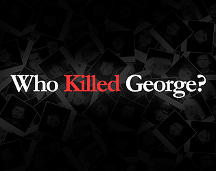

# Who Killed George

A story driven game where you interrogate suspects and try to solve the mistery behind George's death.
The game was developed in the **GMTK Game Jam 2021**, an event where developers have 48 hours to create a game, this year's theme was "Joined Together".

I participated in the jam with the Last Minute Team ([@flaviocravero](https://soundcloud.com/flaviocravero) and [@portluc](https://www.deviantart.com/aewron)).

The game can be played on [itch.io](https://guspassos.itch.io/who-killed-george).

## Built with

- Unity 2020.3.11f

## License

- **[MIT license](http://opensource.org/licenses/mit-license.php)**
